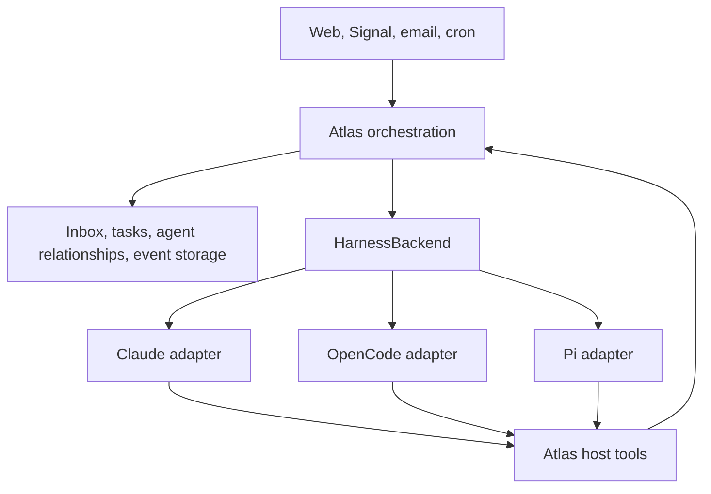

# Backend-independent agent execution

Status: the first Claude Code adapter is implemented. The TypeScript contract is
in [`app/lib/harness.ts`](../app/lib/harness.ts). The existing runner goes through
the adapter's compatibility entry point; migrating its multi-turn coordinator
to the portable run API is a separate step.

## Current implementation

`harness.backend` in config.yml selects the backend; `ATLAS_HARNESS_BACKEND`
overrides it. The default and only registered backend is `claude-code`. Unknown
backend names fail explicitly and never fall back to Claude. Execution backends
are registered in `app/triggers/harness/registry.ts`, their session stores under
the same IDs in `app/lib/harness/stores.ts`. The Claude adapter has separate
modules for session lifecycle, run execution, SDK options, process environment,
model profiles, message normalization and usage accounting; its storage lives in
`app/lib/harness/claude-store.ts`.

Two entry points share the adapter:

- `HarnessBackend.create/resume` returns portable sessions with explicit tool
  capabilities, scoped environments, normalized events and per-run results.
  Each run uses a local SDK process, and later runs resume the native conversation.
- `createAtlasHarness().openConversation` retains the existing long-lived SDK
  conversation and its native events. Both direct mode and persistent triggers
  use this entry point. Its SDK-shaped types are confined to the compatibility
  boundary, though the runner still interprets those events during this stage.

This distinction preserves startup/stop hooks, native Agent delegation, skills,
MCP configuration, model aliases and the exact system prompt in current deployments.
It also preserves the web UI's item IDs, streaming chunk format, notification
order, database schema, usage webhook and existing native-child cost aggregation.
The runner fails with `unsupported` when another backend is configured, because
its conversation loop still interprets the Claude SDK stream.

The portable API currently advertises customTools: false, compactionContext: false
and usageUpdates: final-only. Requests for unsupported host tools or compaction
bindings fail before execution. Existing Atlas hooks, skills, MCP tools and native
subagents continue to work through the compatibility path. No native delegation
is exposed through the portable tool allowlist. A future backend must implement
the portable contract; it does not need to imitate the compatibility API.

Model profiles default to strong/Opus, balanced/Sonnet and fast/Haiku using the
existing model-name expansion. Constructor overrides configure the three profiles.
Legacy `models.main`, `models.trigger`, cron overrides and role-specific routing
retain their existing meaning; this change does not reroute existing tasks by tier.
Context/output limits are null until they can be established reliably.

Portable creation reserves a UUID without invoking the model. Native transcript
storage starts with the first run. History currently returns one snapshot page,
and inspect reports unknown for an existing on-disk session unless this backend
instance knows it is running. A transcript alone does not prove another process
is idle. Atlas remains responsible for its existing process locks.

Claude's final cost and modelUsage fields can be cumulative across resumed
sessions. The portable adapter reads the persisted cost-state before a resumed
run and reports the counter difference, including internal model calls. If the
baseline is missing or stale, it reports partial token usage and an unknown cost.
It never charges the full historical session to a new run. The compatibility
path keeps the existing aggregation and pricing, now behind
`HarnessSessionStore.usage`.

The sections below describe the full architectural contract. Portable host tools,
Atlas-owned delegation and moving completion gates into a coordinator remain
future migration work, not features enabled by this first adapter.

Atlas owns work. A harness backend executes a conversation with a model and
tools. Finishing a backend run is evidence for Atlas to evaluate, never proof
that an Atlas task or goal is complete.



## Ownership

| Concern | Owner |
| --- | --- |
| Channel routing, wake signals, durable pending inputs | Atlas |
| Task gates, validators, journal reminders, retries | Atlas |
| Parent/child agents, budgets, concurrency, workspace assignment | Atlas |
| Identity, memory retrieval, portable skills and role instructions | Atlas |
| Task tier selection for a role or delegated task | Atlas |
| Three configured provider/model profiles | Backend deployment |
| Model loop, native tool execution, native session persistence | Backend |
| SDK hooks, subprocesses or server transport, credentials | Adapter deployment |
| Tool-name translation, events, usage and history normalization | Adapter |
| Context-window management and compaction execution | Backend |
| Durable task context supplied to compaction | Atlas callback |

The contract has no channel names, SQLite handles, Claude hooks, MCP server
configuration or provider SDK types. Adapter construction handles credentials,
server endpoints, plugin installation and version pinning. They do not belong
in an agent's prompt or in the portable SessionSpec.

## Three model tiers

Each backend returns a ModelCatalog through getModels(). It always contains
exactly three profiles with distinct provider/model references:

| Tier | Intended tasks | Claude-family analogy |
| --- | --- | --- |
| strong | Difficult reasoning, architecture, ambiguous investigations | Opus |
| balanced | Routine implementation, substantive reviews, normal agent work | Sonnet |
| fast | Extraction, classification, bounded lookups and simple checks | Haiku |

These names express routing intent, not a benchmark guarantee. Atlas chooses the
tier using task requirements and budget. The backend deployment maps each tier
to a concrete model. Profiles return a display name and context/output limits
when known. No current prices or provider model IDs are hardcoded in the contract.
The same scheme applies to the main agent, validators and child agents.

```typescript
const models = await backend.getModels();
const tier: ModelTier = "fast";
const selection: ModelSelection = { tier, model: models[tier].model };
const session = await backend.create({ ...spec, model: selection }, bindings);
```

Catalog validation rejects missing mappings and duplicate provider/model pairs.
Pointing all tiers at one model with different labels does not fulfill this
contract. Model registration is not a live inference probe; authorization and
provider availability can still fail on use. A deployment that offers only one
model cannot yet satisfy the three-model contract.

Atlas persists the chosen tier and concrete model alongside the session reference.
Changing backend configuration affects new selections; resume uses the saved
selection, even if that model is no longer in today's catalog. The adapter checks
whether the pinned model can still be used and fails explicitly otherwise.
It never silently upgrades to a more expensive tier or substitutes another model.
The session exposes its resolved selection and every RunResult repeats it.

Tier changes for a subsequent task use a new session with an explicit handoff in
this initial design. Changing models inside a persisted conversation is not a
required capability. Backend-internal calls such as compaction may use another
model; their actual model usage is reported separately when attributable.

## Session, run and task are different objects

A session is a backend conversation. Its SessionRef stores the backend ID and
an opaque native ID. Atlas stores its own agent/conversation ID separately.
One backend session allows one active run. The coordinator enforces this across
processes with an Atlas lease; adapters also reject overlapping local starts.

A run starts with one or more inputs and ends when the backend has finished
responding, been cancelled, or failed. It may contain many model requests and
tool calls. Internal SDK turn counts do not define an Atlas run.

A task can span many runs, sessions and child agents. Task completion is a
decision in Atlas, based on its task gate and validator. No task fields belong
in HarnessSession.

Creation returns a native reference before the first prompt is executed. Atlas
persists that reference, the run attempt and input IDs before calling run().
Creating an otherwise empty session must not invoke the model or tools.
Resume reattaches to the same backend only. The supplied spec must remain
compatible with the saved session; unsupported changes fail explicitly.
An active session is not taken over silently. It must be reconciled first.

Changing the backend creates a new session with an Atlas-generated handoff.
Native tool history is not portable conversation state. Existing Claude history
can remain readable through its adapter during migration.

## Execution and message delivery

The coordinator starts consuming run.events immediately and persists normalized
events for the UI. It also awaits run.finished. A slow UI never owns the live
backend stream. Streaming deltas are provisional; message.completed replaces
the displayed message using the same message ID instead of appending it twice.
If streaming is unavailable, complete messages still provide the same history.

Atlas keeps follow-up messages in its durable queue until the active run ends.
There is deliberately no backend followUp() queue with separate crash semantics.
For a message intended to change active work, Atlas may call steer().

An adapter advertising tool-boundary steering must incorporate accepted input
before a subsequent model request at a safe tool boundary. Acceptance alone
does not establish delivery. input.applied reports incorporation into a model
request, not successful understanding or completion. If a run ends before the
input is applied, Atlas retains it for the next run. Duplicate IDs within a live
run must be deduplicated by the adapter.

Without steering support, Atlas explicitly queues the message for the next run
or aborts and resumes according to its routing policy. The adapter must never
quietly turn steering into cancellation or a new run.

Exactly-once tool execution is not promised. After a crash, an input may have
reached the model before its acknowledgement reached Atlas. Reconcile history
and execution state before replaying it. A fresh retry uses a fresh run ID while
keeping the original input ID. Host tools should use call IDs to deduplicate
effects where practical; a new model-generated call can still repeat an effect.

On normal termination, the stream emits exactly one run.finished event and ends.
The finished promise resolves to the same result even if the event consumer has
stopped reading. Adapters need bounded buffering; overflow must terminate the
local run with a reported failure rather than silently dropping final messages.

abort() requests cancellation. Its acknowledgement does not prove external
work stopped; Atlas awaits finished. If a transport fails while the backend may
still be working, the result carries executionState: unknown. Atlas uses inspect()
and reconciliation before starting competing work. inspect() reports unknown
when an answer cannot be established, rather than guessing idle or missing.
close() releases an idle handle without deleting history; it rejects while a
run is active. Cancellation cannot undo effects a tool already performed.

## Hooks become Atlas policy

The current Stop hook mixes execution lifecycle with task policy. In this design,
Atlas evaluates task completion after outcome: completed. It can enqueue another
input in the same session with validator feedback or unfinished tasks. It only
marks its own work finished after that evaluation. Partial assistant text may
already be visible, but it is not an Atlas completion signal.

For aborted or failed runs, Atlas applies cancellation/recovery policy first.
An explicit user stop must not immediately restart through a task gate. Retry
limits and backoff belong to Atlas. An adapter error does not authorize replay
of tools that may already have executed.

Session-start context is composed by Atlas before execution. The optional
compactionContext callback supplies current task and memory references whenever
the backend compacts. The adapter must preserve this supplied context in the
continuation, not merely notify Atlas that compaction happened. A callback error
fails the run rather than silently dropping required context.

This callback does not let the model perform a last-minute memory write. Atlas
must checkpoint important state during ordinary work or schedule an explicit
memory-saving run while context is still available. Portable pre-compaction
tool execution is not assumed.

## Tools and subagents

Native coding tools stay in the backend. Atlas requests an explicit set of
capabilities and the adapter maps these to native tools. Unrequested tools,
including native task managers, interactive approval tools and native delegation,
must not be exposed. If the adapter cannot enforce the requested configuration,
opening the session fails with unsupported or configuration.

The capability set describes available tools, not an operating-system sandbox.
For example, process.exec permits commands that can modify files or access the
network. A strict read-only worker must omit it or use separate OS enforcement.
There is no universal bypassPermissions flag or implicit interactive prompt.

Atlas functions are HostTool definitions with JSON Schema and an execute callback.
Adapters can expose them through SDK tools, a local bridge or MCP. MCP is one
transport option, not the core's tool model. The host validates input, binds the
owning Atlas agent through a closure, and forwards cancellation to handlers.
SessionBindings are reconstructed after restart.

For example, an Atlas agent.spawn tool creates another ordinary backend session.
Atlas records its parent, role, task assignment and workspace. Tools such as
agent.send, agent.status and agent.cancel operate on those records. This permits
different backends for parent and child without requiring cross-backend native
subagent APIs. Initial child context is an explicit handoff, not an assumed copy
of the parent's internal conversation. Depth limits and cancellation of a whole
agent subtree are decisions in the coordinator.

This is the target architecture. During extraction, the current Claude-native
Agent tool may remain behind an explicitly marked compatibility path. That path
does not yet implement portable delegation and cannot claim the final contract's
tool or cost semantics. Porting orchestration and supporting a second backend
are separate migration steps.

toolEnvironment applies to each session's tool subprocesses, including resumed
sessions. Adapters must not mutate a shared server's global environment. Atlas
host tools should use their bound execution context instead of environment
variables. Existing CLI tools may retain ATLAS_TRIGGER and session-key variables
until their callers have been migrated.

## Storage, costs and failures

Atlas stores backend references, attempts, pending/applied inputs, normalized
events and parent/child relationships. Backend-native storage remains authoritative
for resuming model context. history() supports import and reconciliation without
requiring UI or dreaming jobs to parse native files. History messages have stable
IDs and chronological pagination; adapter cursors refer to a stable snapshot so
concurrent appends do not reorder pages. Tool results and multimodal inputs are
preserved; backend-private reasoning data is not part of this initial contract.

Every RunResult returns the run and session IDs, pinned model selection, last
completed assistant message, usage and execution metrics as well as the outcome.
The same fields are present on cancellation and failure. A last message may be
intermediate work, so callers must check the outcome before treating it as a
successful response. Message IDs match the event stream and history.

UsageReport contains a run total and a per-model breakdown when the total can be
fully attributed. The breakdown includes backend-internal calls such as compaction
and is a partition of the total, not another amount to add. If attribution is
unavailable, byModel is null. Reported total coverage can itself be partial.
Cache tokens are separate from uncached input tokens; outputTokens includes
reasoning tokens where they count as output, with no additional reasoning bucket
to double-count. Adapters translate provider counting conventions. Unknown values
are null, never a misleading zero. Costs state whether they are reported or
estimated; any total containing estimated components is marked estimated. Unknown
cost components require partial coverage. Costs describe model usage, not invoices,
subscription charges or unrelated external tool fees.

Backends supporting live usage emit usage.updated snapshots when new usage becomes
known. Each snapshot is cumulative for this run. Atlas replaces the previous
snapshot using the event sequence, and upserts the final snapshot by run ID from
run.finished or finished. It must not sum events, sum snapshots with final usage,
or count both completion paths. Adapters without live reporting declare final-only
but still return the final report, marking missing measurements unavailable.
Even the last report after a connection loss can be partial. It represents the
adapter's final knowledge, not proof that remote billing has ended.

Usage snapshots support budget monitoring but cannot guarantee an exact spending
cap: providers may report after completing a request. Atlas chooses whether to
abort active work and which tier to use for subsequent tasks. Atlas sums child
runs itself, so a parent's usage excludes children created through Atlas host tools.

RunMetrics returns start/end times, wall duration, model request count, tool call
count and compaction count. Unknown counts are null. Wall duration includes tool
execution and retries; it is not an inference latency measurement. Request counts
include observed retries and internal compaction requests. These values allow
Atlas to compare cost and duration by backend, concrete model, tier and task type.

Operations that fail before or outside execution throw HarnessOperationError,
carrying a HarnessError under its detail property. Once a run exists, execution failures
resolve finished with outcome: failed. Provider text and SDK exceptions are
translated in the adapter. Atlas chooses retry or replacement; the adapter never
silently creates a new session after a failed resume.

Capabilities advertise optional features, not a promise that every model supports
every request. create/resume validate the selected model, requested tools and
required bindings before use; run/steer validate each input, including its image
format, before accepting it.

## Session storage

`HarnessSessionStore` (in `app/lib/harness.ts`) is the read side of a backend:
no model execution and no SDK, so the web-ui can use it without bundling the
agent SDK. `HarnessBackend.sessions` exposes the same store to the runner. Every
Atlas reader of session history or metadata goes through it:

| Method | Used for |
|---|---|
| `ref`, `exists` | Validating persisted session IDs; "history missing, start fresh" |
| `metadata` | Last activity including nested agents (stale runners, "stuck" runs), last conversation entry, whether the agent still owes a response (chat run state) |
| `excerpt` | Bounded synchronous reads for list views: first prompt, last answer, error hint |
| `load` | Activity transcripts, whole or cut to a run's time window |
| `cursor` | Incremental live chat reads; `until` reproduces an earlier view |
| `watch` | Change notification for the live chat, null when unsupported |
| `usage` | Run cost across the session and its nested agents, each request once |
| `locate` | File browser links from storage files to the session view |

History entries are normalized: user text, assistant text, reasoning, tool call
and tool result, each with a stable ID and a `nested` flag for nested agents.
An assistant entry's `messageId` equals the `messageId` of its live `text.delta`
events, which lets the chat replace a streamed draft with the stored text.
Presentation (clipping, pairing results with calls, item IDs) stays with the
reader. Positions and byte budgets are opaque hints; a backend without byte
offsets may interpret them approximately.

## Remaining migration

1. Move the runner's conversation loop off SDK message shapes: normalized
   conversation events instead of `stream_event`/`result`, provider error
   classification in the adapter. Python and shell readers of native transcripts
   (dreaming's session extraction, cleanup, the validator stop hook) still need a
   store-backed CLI.
2. Move completion gates, pending input ownership and normalized event persistence
   into the Atlas coordinator. UI and memory readers consume Atlas data or history().
3. Introduce Atlas host tools for delegation and persist agent relationships.
   Translate role prompts and skills instead of exposing Claude tool names.
4. Implement a second adapter against the same contract. Keep native IDs opaque
   and require backend selection only when creating a session.

Adapter acceptance scenarios should cover resume after restart; an input arriving
at the last tool boundary; cancellation with pending messages; a transport loss
while a tool runs; continued work after a failed task gate; compaction preserving
task context; isolated environments for concurrent conversations; tool allowlists;
child costs counted exactly once; usage snapshots replaced rather than summed;
all three distinct model profiles; pinned models surviving catalog changes; and
usage returned on failed and aborted runs. These tests belong with implementations.
The adapter includes contract tests and an independent baseline check of the
pre-extraction SDK options. Existing runner and web-UI tests cover compatibility.
